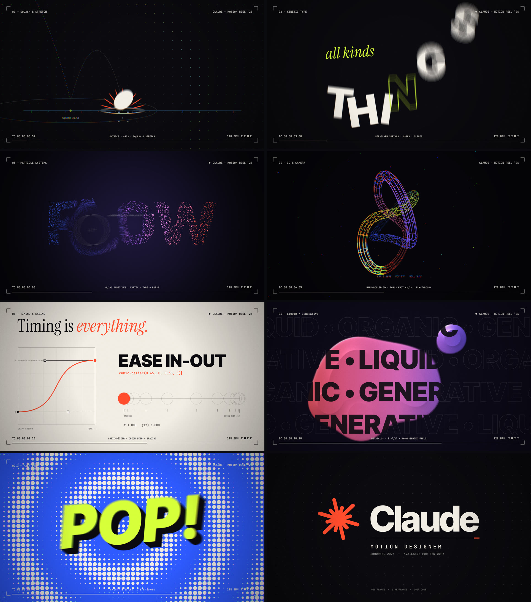

# CLAUDE — MOTION REEL ’26

A 15-second, 1080p60 motion graphics showreel with a synced soundtrack. It's built entirely in code: no After Effects, no keyframes, no stock assets.

**▶ [`showreel.mp4`](showreel.mp4)**  ·  Also in this repo, built on the same engine: the [Seventh Seal brand reel](seventhseal/) and the [«Adminpanelet» announcement](adminpanel/).



## The cut

The reel runs at 128 BPM, so 8 bars come to exactly 15.000 s. Every cut lands on a beat.

| # | Time | Shot | What it shows off |
|---|---|---|---|
| 01 | 0.00 | **Squash & stretch** | Projectile arcs, velocity-aligned stretch, spring squash on contact, an AE-style motion path with keyframe diamonds, and a morph from ball to square that zooms through into the next shot |
| 02 | 1.88 | **Kinetic type** | *I MAKE / all kinds of THINGS / MOVE*: masked glyph rises, per-letter damped springs, outline echoes, and a 12-slice split transition |
| 03 | 3.75 | **Particle systems** | 4,200 particles with light trails. A galaxy vortex resolves into the word *FLOW*, a repulsor field sweeps through it, and it ends in a hyperspace burst |
| 04 | 5.63 | **3D & camera** | A hand-rolled perspective pipeline: a tunnel fly-through with a camera roll, then a (2,3) torus knot built as a wireframe tube that draws itself on, depth-sorted and fogged |
| 05 | 7.50 | **Timing & easing** | A graph editor whose cubic-bézier handles snap between presets on the beat, with onion skins, a spacing chart and live ƒ(t) readouts. *Timing is everything.* |
| 06 | 9.38 | **Liquid / generative** | Metaballs (Σ r²/d²) with Phong shading computed from the field gradient, and marquee type that inverts inside the liquid |
| 07 | 11.25 | **Rapid fire** | 8 styles on 8 half-beats: isometric wave, radial burst, halftone pop, RGB glitch, infinite zoom, rhythm stripes, data viz and a loading counter |
| 08 | 13.13 | **End card** | A mark assembled from staggered springs, a masked wordmark and a decoded subtitle |

Finishing touches: true sub-frame motion blur (10 samples, 180° shutter) with every hard cut protected, camera shake and radial chromatic aberration keyed to impacts, film grain, vignette, and a HUD that adapts its colour to each shot.

## Sound

`src/audio.js` synthesises the whole score from scratch in pure JS: kick, clap, hats, a sidechained bass, pads, ping-pong plucks, stabs, FM bells, risers, whooshes, impacts and a glitch stutter. It then runs the mix through a Freeverb-style reverb and a soft-clip master. It reads the same `src/timeline.js` as the visuals, so every hit is locked to the frame it belongs to.

## Build it

```bash
npm install
pip install imageio-ffmpeg         # or have ffmpeg with libx264 on PATH (or set FFMPEG=/path/to/ffmpeg)
npm run render                     # → showreel.mp4 (~2 min on 4 cores)
npm run draft                      # fast preview, no motion blur
node scripts/render.mjs --stills 3.2,9.9   # PNG stills at given times
```

For a live preview with sound in the browser, serve `src/` (for example `npx serve src`) and open it.

Every frame is a pure function of time. That's what lets the renderer split frames across parallel headless-Chromium workers and supersample time for motion blur.
