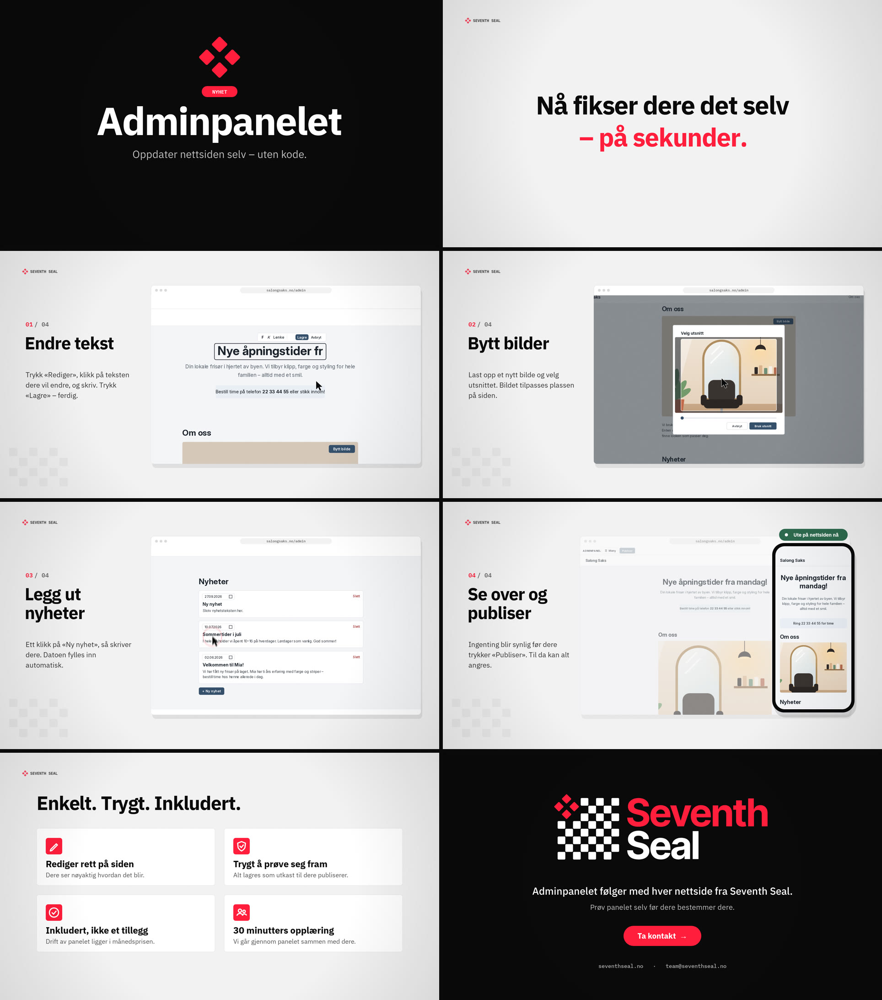

# SEVENTH SEAL — «Adminpanelet» (announcement video)

A 54-second 1080p60 announcement video for customers, in Norwegian. It introduces the admin panel that comes with every Seventh Seal website.

**▶ [`adminpanelet.mp4`](adminpanelet.mp4)** (H.264, 6.9 MB)  ·  [`adminpanelet.webm`](adminpanelet.webm) (VP9, 6.2 MB)  ·  poster: [`media/poster.jpg`](media/poster.jpg)



## On the website

```html
<video controls playsinline preload="metadata" poster="/video/adminpanelet-poster.jpg">
  <source src="/video/adminpanelet.webm" type="video/webm" />
  <source src="/video/adminpanelet.mp4" type="video/mp4" />
</video>
```

Every message is on screen, so the video also works muted. If you want it to autoplay, add `autoplay muted loop`, because browsers only autoplay muted video.

## The story

The video is for customers, not developers. It shows what they can do, and never how it's built.

| Time | Scene | On screen |
|---|---|---|
| 0:00 | Intro | *NYHET — Adminpanelet. Oppdater nettsiden selv – uten kode.* |
| 0:04 | Hook | *Nye åpningstider? Nytt bilde? Noe nytt å fortelle?* → *Nå fikser dere det selv – på sekunder.* |
| 0:10 | 01 Endre tekst | «Rediger» → click the heading → type → «Lagre». The counter shows *1 endring* |
| 0:18 | 02 Bytt bilder | «Bytt bilde» → «Velg ny fil …» → «Velg utsnitt» (drag) → «Bruk utsnitt» |
| 0:26 | 03 Legg ut nyheter | «+ Ny nyhet» → a new card with today's date → write the title → «Lagre» |
| 0:32 | 04 Se over og publiser | «Vis siden» → «Publiser» → *3 endringer publisert* → the live site on a phone |
| 0:40 | Fordeler | Rediger rett på siden · Trygt å prøve seg fram · Inkludert, ikke et tillegg · 30 minutters opplæring |
| 0:48 | Outro | *Adminpanelet følger med hver nettside fra Seventh Seal.* · *Prøv panelet selv før dere bestemmer dere.* · Ta kontakt |

## Faithful to the product

The panel shown is a recreation of the real adminsystem, not a mock-up. I ran the real app, went through the flow, and matched these details:

- **Labels:** Rediger / Vis siden, F / K / Lenke / Lagre / Avbryt, Bytt bilde, Velg ny fil …, Beskrivelse av bildet, Velg utsnitt / Bruk utsnitt, + Ny nyhet, Slett, Publiser, «n endringer», Forkast endringer, «n endringer publisert».
- **Design:** the design tokens from `src/styles/tokens.css`, including the `#35506b` accent, 6 px radius, no shadows, and the Inter variable font.
- **Behaviour:**
  - Dashed frames on editable text.
  - The image frame keeps its shape while you choose the crop.
  - New news cards get today's date.
  - Nothing goes live until you press «Publiser».

The demo customer is the panel's own demo site, «Salong Saks».

The claims in the benefits and outro come from seventhseal.no:

- The panel is included, not an add-on.
- Running it is covered by the monthly price.
- Onboarding is a 30-minute walkthrough.
- You can try the panel before you decide.

## Build it

From the repo root:

```bash
node scripts/render.mjs --src adminpanel/src --out adminpanel/adminpanelet.mp4
node scripts/render.mjs --src adminpanel/src --stills 14,21.6,38.5   # PNG stills
```

Scene lengths and the moments of every click and keystroke are defined in `src/timeline.js`, and both the picture and the sound follow them.
