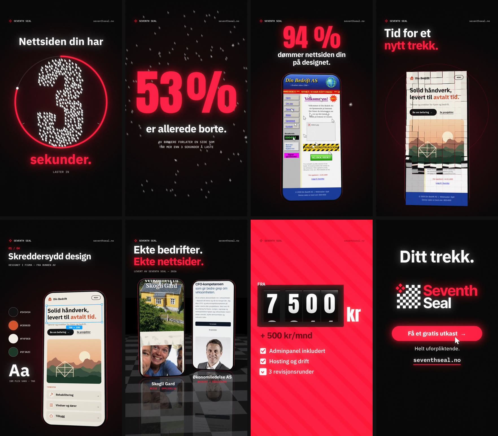

# SEVENTH SEAL — «Ditt trekk» (vertical ad reel)

A 33-second, 1080×1920, 60 fps ad for [Seventh Seal](https://seventhseal.no), made for Reels, TikTok and Shorts, with a synced soundtrack. It's all code, like the other reels in this repo, but this one adds a small WebGL2 renderer, so the phones, the flipping tiles, the odometer and the chess board are real 3D with lighting, reflections and shadows.

**▶ [`ditt-trekk.mp4`](ditt-trekk.mp4)**  ·  poster: [`media/poster.jpg`](media/poster.jpg)



## The idea

The reel is a pitch that tells a story, in the order a small-business owner scrolling past would feel it:

1. **The hook is a threat with a clock on it.** *Nettsiden din har 3 sekunder.* A thousand mouse cursors, the visitors, form the digits, and the ring runs down in real seconds. At zero, 53 % of them fly off the screen.
2. **A mirror.** The old website, the one many small businesses still have: marquee, hit counter, «Under konstruksjon», a dial-up handshake and a MIDI tune that tape-stops.
3. **The move.** A red diamond from the logo lands on the old site like a chess piece, and the whole screen flips over tile by tile into a new site. The beat drops.
4. **What you get**, one line at a time: skreddersydd design, bygget i kode, rask lastetid, oppdater selv i adminpanelet.
5. **Proof.** Two real client sites, Skogli Gard and Økonomiledelse AS, on phones.
6. **The offer.** *Byråkvalitet, uten ~~byråpris~~.* The price rolls in on a mechanical odometer, followed by what's included.
7. **The call to action is the brand.** *Ditt trekk.* A red king steps forward on a chessboard. The camera rises until the board is the Seventh Seal logo (it has always been an 8×8 board), and the king bursts into its four red diamonds. Each diamond lands on a note of the reel's theme, and the music turns from minor to major. Then *Få et gratis utkast*.

The first frame reads on its own as a thumbnail, and the last frame is a clean end card that loops back into the hook.

## The cut

120 BPM, so one beat is half a second and the countdown runs in real seconds. Every cut lands on a beat. Scene lengths and every key moment live in `src/timeline.js`, and both the picture and the sound follow them.

| Time | Scene | On screen |
|---|---|---|
| 0:00 | **3 sekunder** | *Nettsiden din har 3 sekunder.* A swarm of 1,000 cursors counts down 3 → 2 → 1 inside a draining ring |
| 0:03 | **Borte** | The swarm bursts. *53 % er allerede borte.* *(Av brukere forlater en side som tar mer enn 3 sekunder å laste)* |
| 0:05.5 | **Dømt** | The old «Din Bedrift AS» site slams in on a phone. The last cursors hesitate and leave. *94 % dømmer nettsiden din på designet.* |
| 0:08 | **Nytt trekk** | *Tid for et nytt trekk.* The diamond lands, 220 tiles flip, and the phone spins on the drop |
| 0:10 | **Leveransen** | 01 Skreddersydd design · 02 Bygget i kode · 03 Rask lastetid · 04 Oppdater selv. The callouts track the 3D phone |
| 0:16 | **Ekte nettsider** | Skogli Gard and Økonomiledelse AS on phones on a glossy board, with their pages scrolling |
| 0:21 | **Byråkvalitet** | *Byråkvalitet, uten byråpris.* over the 7S glyph storm from the site's hero |
| 0:23 | **Pris** | *Fra 7 500 kr + 500 kr/mnd* on a 3D odometer, then *Adminpanel inkludert · Hosting og drift · 3 revisjonsrunder · Normalt ferdig på 2–4 uker*, *Ingen mva i tillegg* |
| 0:27 | **Ditt trekk** | The king moves and the board becomes the logo. *Få et gratis utkast →* · *Helt uforpliktende.* · seventhseal.no |

**Pacing.** Every line lands and then holds for at least about a second. Sentences get roughly one second per 18 characters.

**Safe zones.** The key copy stays inside the area that Reels and TikTok leave clear: roughly x 70–940 and y 260–1480. That keeps it clear of the caption and buttons at the bottom and the action rail on the right.

**Muted.** Every message is on screen, so the ad works without sound, which is how most feeds autoplay.

## Faithful to the brand

- **Copy.** The copy is in Norwegian and comes from seventhseal.no: the 53 % and 94 % statistics from the 7 søyler, *Byråkvalitet, uten byråpris.*, the prices and what's included, the admin panel, and the free first draft.
- **Logo.** The real `logo-7S.svg` is parsed at runtime. The final lockup is drawn from its own squares, diamonds and wordmark paths.
- **Palette and type.** `#FF1E3C`, `#D70022`, `#0A0A0A` and white. The type is IBM Plex Sans (the site's typeface), IBM Plex Mono and Anton.
- **Client work.** The client sites are real mobile screenshots of skogligaard.no and okonomiledelse.com.
- **Demo sites.** «Din Bedrift AS» is a made-up business, used so the before and after don't misrepresent a real client.

## How it's made

- **`src/gl3d.js`** is a compact WebGL2 renderer:
  - rounded device bodies, lathed chess pieces, drum arcs and boxes;
  - a PBR-style material lit by a procedural studio environment (softboxes, strip lights and a red kicker);
  - PCF shadow maps;
  - a reflective chessboard floor (a mirror pass plus Fresnel);
  - canvas textures for the screens.

  Each material mode compiles to its own shader, and the environment and shadow lookups are kept cheap. On SwiftShader that made a full 3D shot about 3× faster than the first version.
- **Motion blur and anti-aliasing come from the same samples.** Each frame is up to 8 sub-frame samples, and each sample's projection is offset by a sub-pixel Halton jitter, so the 3D gets both motion blur and anti-aliasing. Samples never straddle a cut.
- **Post** runs on the GPU: bloom (weighted toward the brand red), chromatic aberration and lens breathing on impacts, flashes, vignette and grain.
- **`src/sites.js`** draws both «Din Bedrift» sites in code, animated: the marquee, the spinning globe, the hit counter, and the admin-panel edit with «Rediger», typing, «Lagre» and «Publisert».
- **`src/audio.js`** synthesizes the whole score from the shared timeline, so every hit lands on its frame.

## The music

120 BPM in D minor, mixed to about −14.5 LUFS.

**A theme.** The reel has a four-note motif: D, up a minor seventh to C (a nod to *Seventh*), then A and F. It runs through the whole piece:

- on a music box over the countdown, one note per second;
- falling bells (F, E, D) after the 53 % burst;
- the lead line after the drop, as a syncopated 3-3-2 phrase;
- in octaves over the price;
- finally on the four diamonds as they land on the board: the sonic logo.

**Arrangement:**

| Time | Section | Harmony | What plays |
|---|---|---|---|
| 0:00 | Countdown | D pedal | Clock ticks, heartbeat, braams on each second, the motif on a music box |
| 0:05.5 | Old site | (gag) | Dial-up handshake, a cheesy MIDI tune that tape-stops (resampled) |
| 0:08 | Flip | Cadd9 | 220 tile clicks, a supersaw swell opening up, snare roll, a pulsing bass |
| 0:09 | Drop | Dm9 · B♭maj9 · F · Cadd9 | Four-on-the-floor with swung hats, rims and shakers, a rolling syncopated bass, and the motif |
| 0:16 | Proof | Gm9 · B♭maj9 · C | A filter "breath" as the phones land, thinner drums, a 16th arpeggio |
| 0:21 | Claim | B♭ · C | Supersaw chords, a rising lead run, a snare roll into the price |
| 0:23 | Price | Dm9 · Gm9 · A7 | A second drop with a reese bass, the motif in octaves, and odometer ratchets. A C♯ leading tone pulls into the end card |
| 0:27 | Ditt trekk | Dadd9 · B♭ · C → D major | Dark and still under a chess clock (a callback to the countdown), the sonic logo, then a turn to D major on the lockup, resolving F♯ → E → D |

**Mix.** Melodic parts go through a music bus that is filtered as a whole, closed for builds and open for drops. Pads and chords pump with the kick through a sidechain. The mix also has a dotted-eighth ping-pong delay and a Freeverb-style reverb.

**Sound design.** Keyboard foley, checklist dings, and a click for every tile.

## Build it

From the repo root:

```bash
npm install
node scripts/render.mjs --src dittrekk/src --out dittrekk/ditt-trekk.mp4          # full render (motion blur)
node scripts/render.mjs --src dittrekk/src --subsamples 1 --out draft.mp4          # fast draft
node scripts/render.mjs --src dittrekk/src --stills 0,9.2,23.8,30.5                # PNG stills
```

Headless Chromium runs the WebGL on SwiftShader, so no GPU is needed. For a live preview with sound, serve `dittrekk/src/` (for example `npx serve dittrekk/src`) and open it in a browser.
