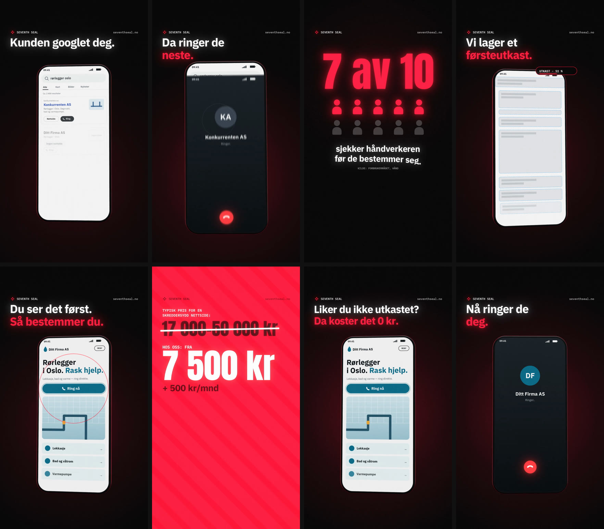

# SEVENTH SEAL — «Kunden googlet deg» (vertical ad reel)

A 34-second, 1080×1920, 60 fps ad for Reels, TikTok and Shorts, aimed at **businesses with no website**. The offer is the **free first draft** (*gratis førsteutkast*). It's built in code on the same engine as [«Ditt trekk»](../dittrekk/), with a 3D phone, real lighting and sub-frame motion blur.

**▶ [`kunden-googlet-deg.mp4`](kunden-googlet-deg.mp4)**  ·  poster: [`media/poster.jpg`](media/poster.jpg)



## Who it's for

Tradespeople, salons and small firms that get found by name or by trade, but have no website, or only a listing. They're busy, sceptical of agencies and price-aware. They don't think they *need* a website, so the ad shows them what they lose without one.

## The story, and why each beat is there

The research behind it, with sources, is in [`../research/short-form-ads.md`](../research/short-form-ads.md).

| Time | On screen | Why |
|---|---|---|
| 0:00 | *Kunden googlet deg. Hva fant de?* A search for «rørlegger oslo» on a phone. Your card says **Ingen nettside**, between two competitors with sites | The first frame reads on its own. It calls out the audience and opens a curiosity gap (Loewenstein). The logo is on screen from the first second |
| 0:02.5 | *Da ringer de neste.* The customer's thumb taps the competitor's **Ring** button, and the call starts | Loss framing (Kahneman & Tversky): show what you lose, not what you might gain |
| 0:04.5 | *7 av 10 sjekker håndverkeren før de bestemmer seg.* Ten people, seven light up | A real, sourced Norwegian statistic (Forbrukerrådet, Håndverkerrapport 2024) |
| 0:07.5 | The logo assembles. *Det fikser vi.* → (0:09) *Vi lager et førsteutkast.* A site for «Ditt Firma AS» builds on the phone, from wireframe to design, with a progress chip | The turn. The brand appears at the moment of relief. The build is the product demo |
| 0:12 | *Du ser det først. Så bestemmer du.* «Ring nå» pulses | Risk reversal and a free first step (zero-price effect) |
| 0:15 | *Typisk pris for en skreddersydd nettside: 17 000–50 000 kr* is struck through → **Fra 7 500 kr + 500 kr/mnd**, then what's included | Anchoring, with specific numbers (3 revisjonsrunder, 2–4 uker) |
| 0:22.5 | The finished site spins in. *Liker du ikke utkastet? Da koster det 0 kr.* | The peak, at about 70 % of the runtime (peak-end rule) |
| 0:25.8 | The same search again, and this time **your** card has the site. The thumb taps *your* Ring. *Nå ringer de deg.* | Closes the loop the hook opened |
| 0:28.5 | Logo · **Be om gratis førsteutkast →** · *Helt uforpliktende.* · seventhseal.no | One CTA. The end card loops back into the hook |

## Rules it follows

- **Pacing.** At most ~7 words per card at about 3 words a second (subtitle reading norms), and every card holds at least 1.5 s.
- **Safe zones.** All copy sits inside y 280–1240, the area both Reels and TikTok leave clear.
- **Works muted.** Every message is on screen. The sound adds keys, the error buzz, a Norwegian ringback tone and the beat.
- **Honest.**
  - «Ditt Firma AS», «Konkurrenten AS» and «Nabofirmaet AS» are made up, and so are the search results.
  - No reviews, ratings or customer counts are shown.
  - The search app is generic and imitates no real search engine.
  - The price, what's included and the free first draft come from seventhseal.no.
- **Confirm before publishing.** The anchor range (17 000–50 000 kr) is from a Norwegian price guide ([Byråmatch](https://www.xn--byrmatch-c0a.no/fagbloggen/hva-koster-en-nettside-i-norge)). Seventh Seal should be comfortable comparing against it.

## Build it

From the repo root:

```bash
node scripts/render.mjs --src googlet/src --out googlet/kunden-googlet-deg.mp4
node scripts/render.mjs --src googlet/src --stills 0,2.8,10,23.5           # PNG stills
```

`src/kit.js` holds what the Seventh Seal reels share: the 3D phone, the parsed logo, a touch indicator, and the frame pipeline. `src/screens.js` draws the phone screens. `src/audio.js` synthesizes the score from `src/timeline.js`.
