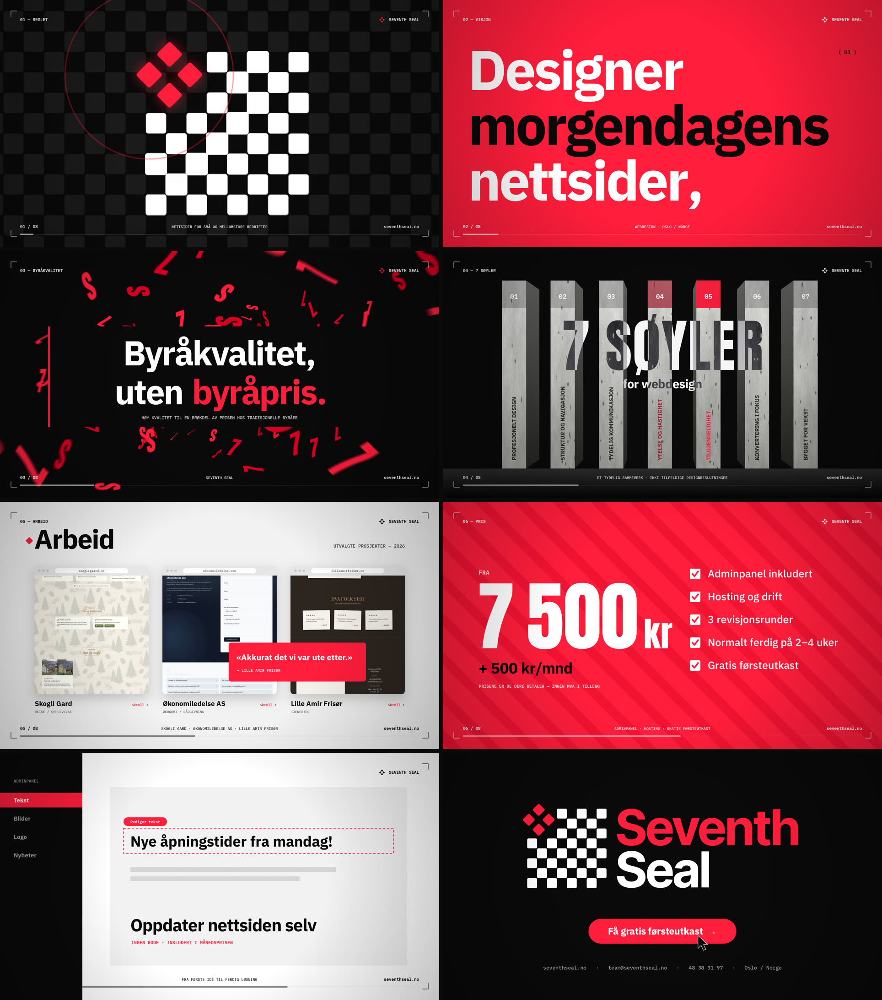

# SEVENTH SEAL — Brand Reel

A 43-second, 1080p60 brand reel for [Seventh Seal](https://seventhseal.no) with a synced soundtrack. Like the reel in the repo root, it's all code: no keyframes, no stock assets.

**▶ [`seventhseal-reel.mp4`](seventhseal-reel.mp4)**



## Built from the brand

All of the material comes from seventhseal.no:

- **Logo.** The real `logo-7S.svg` is parsed at runtime. Its 28 board squares, four diamonds and "Seventh / Seal" wordmark paths are animated individually.
- **Palette.** `#FF1E3C` red, `#D70022`, `#0A0A0A` and white, taken from the site CSS.
- **Type.** IBM Plex Sans (the site's typeface), IBM Plex Mono for UI details, and Anton for the heavy condensed display type in the OG image.
- **Motifs.** The chessboard (a nod to Bergman's *The Seventh Seal*), the flying italic "7S" glyphs from the hero video, and brutalist concrete with red accents.
- **Copy.** All in Norwegian and taken from the site: the tagline, *Byråkvalitet, uten byråpris.*, the 7 søyler, prices, process steps and the three case studies.

## The cut

The reel runs at 128 BPM in D minor, and every cut lands on a beat.

**Pacing.** Each shot is as long as its text needs, and the motion and cuts stay fast. Headlines hold for at least about a second after they land, and sentences get roughly one second per 18 characters. The quote, the price list, the stats and the end card each get a proper hold, while shots with no text stay short. Scene lengths live in the `PLAN` table and the montage cut lengths in `MONTAGE_BEATS`, both in `src/timeline.js`. The picture and the soundtrack both follow them.

| # | Time | Bars | Shot | What happens |
|---|---|---|---|---|
| 01 | 0:00 | 1 | **Seglet** | The board fills in and the four red diamonds land on the beat, each with a chess-piece "clack". The camera then dives into a diamond |
| 02 | 0:02 | 2 | **Visjon** | *Designer / morgendagens / nettsider,* builds line by line and holds, then *i dag.* and a board-square wipe |
| 03 | 0:06 | 2 | **Byråkvalitet** | A 3D storm of italic 7 and S glyphs behind *Byråkvalitet, uten byråpris.* |
| 04 | 0:09 | 3 | **7 søyler** | Seven concrete pillars rise. Each lights up red for one beat, in order, with its name turning red, so the eye reads them one at a time |
| 05 | 0:15 | 3 | **Arbeid** | Three live case studies scroll on the beat, then the testimonial card |
| 06 | 0:21 | 2 | **Pris** | A slot-machine *7 500 kr*, *+ 500 kr/mnd*, and a checklist that ticks on the beat |
| 07 | 0:24 | 7 | **Prosess** | 8 cuts, each 2–5 beats depending on its text: Figma, kode, responsivt, adminpanel, ytelse (53 %), SSL, universell utforming (15 %), Google |
| 08 | 0:38 | 3 | **Kontakt** | The lockup assembles, the cursor clicks *Få gratis førsteutkast*, and the contact line holds |

## Build it

From the repo root:

```bash
npm install
pip install imageio-ffmpeg   # or have ffmpeg with libx264 on PATH
node scripts/render.mjs --src seventhseal/src --out seventhseal/seventhseal-reel.mp4
node scripts/render.mjs --src seventhseal/src --stills 6.9,14.9   # PNG stills
```

For a live preview with sound, serve `seventhseal/src/` (for example `npx serve seventhseal/src`) and open it.
