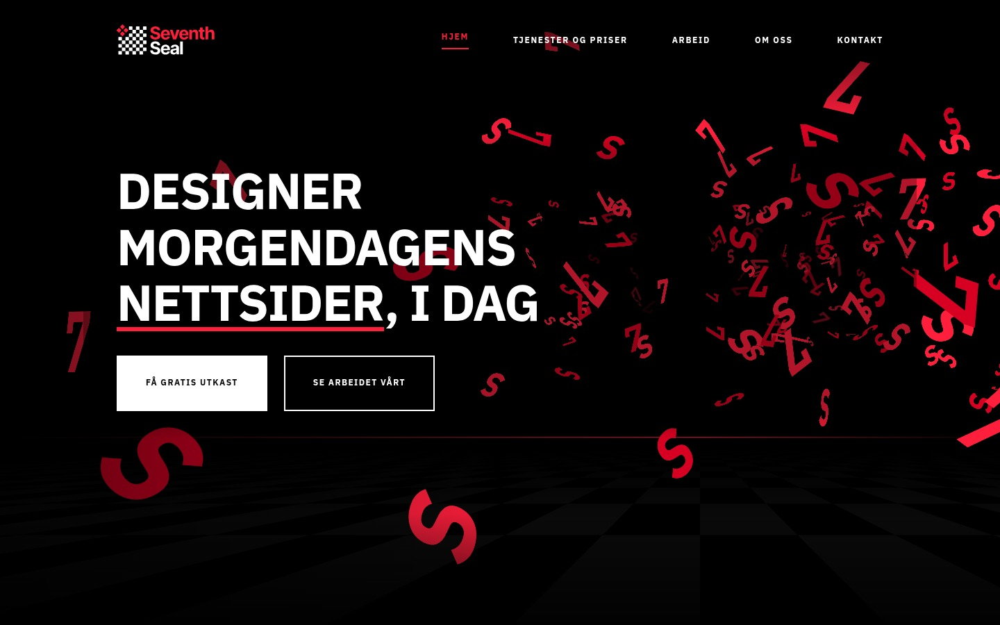

# Seventh Seal: live hero («levende hero»)

A new hero for seventhseal.no. It keeps the same identity (the red 7 and S glyphs, the black field and the same headline and buttons) but renders it **live in the browser** instead of playing a video.

▶ Previews: [`preview/hero-live-desktop.mp4`](preview/hero-live-desktop.mp4) · [`preview/hero-live-mobil.mp4`](preview/hero-live-mobil.mp4)



## What's new

- **Depth and composition.** The glyphs stream toward the viewer from a vanishing point to the right of the headline, so the text keeps a calm side. A faint perspective chessboard floor, the board from the logo, gives the hero real depth under a thin red horizon.
- **Warp-in on load.** The field arrives at high speed and settles. At the same time the headline rises in, the buttons follow, and a red line draws under *nettsider*.
- **It reacts to people:**
  - glyphs part around the cursor, with a soft red glow and depth parallax;
  - a click or tap on the hero bursts them outward (links and buttons stay links and buttons);
  - hovering or focusing **Få gratis utkast** speeds the field up;
  - scrolling out of the hero warps the glyphs past you into section 02.
- **Faster page.** 18 KB of script (6 KB gzipped) replaces the 2.3 MB `hero-7s.mp4`.

## What doesn't change

- **Layout.** The canvas uses the same class as the video, `hero__media`, so every existing layout rule still applies: full-bleed on desktop, the band under 1024 px, the row in portrait, and the header's transparent-over-hero behaviour. No new layout CSS.
- **Reduced motion.** With `prefers-reduced-motion`, the script never starts. `.hero__media` is hidden by your existing rule and the poster is painted on `.hero`, exactly as today. It also reacts if the setting changes after load.
- **Accessibility and copy.** The canvas is `aria-hidden`, and the headline and buttons are untouched HTML, so `site-copy` still owns the text. Contrast is unchanged: your existing scrim stays, and the canvas adds its own fade on the text side and under the header.
- **Resources.** The script pauses when the hero is off-screen or the tab is hidden, caps pixel density, and drops to fewer glyphs with no blur if the first seconds run slowly.

## Integration (3 changes in `index.html`)

1. Replace the video:

   ```html
   <video class="hero__media" … poster="assets/hero-7s-poster.webp" …>
     <source src="assets/hero-7s.mp4" type="video/mp4">
   </video>
   ```

   with:

   ```html
   <canvas class="hero__media hero-live" width="1898" height="876" aria-hidden="true"></canvas>
   ```

2. Add the stylesheet after `accent.css`:

   ```html
   <link rel="stylesheet" href="css/hero-live.css" />
   ```

3. Add the script next to `hero-header.js`:

   ```html
   <script src="assets/hero-live.js" defer></script>
   ```

Copy `hero-live.js` to `assets/` and `hero-live.css` to `css/`. Keep `hero-7s-poster.webp`, which is the fallback for no-JS and reduced motion. `hero-7s.mp4` can go.

## Try it locally

`demo/` is a copy of the current homepage with the three changes applied:

```bash
cd sitehero/demo && python3 -m http.server 8080   # open http://localhost:8080
```

## Tuning

These values live at the top of each block in `hero-live.js`:

- **Glyph count:** `populate()`.
- **Speed:** the cruise speed in `step()`.
- **Vanishing point and horizon:** `measure()`.
- **Floor strength:** `alpha` in `drawFloor()`.
