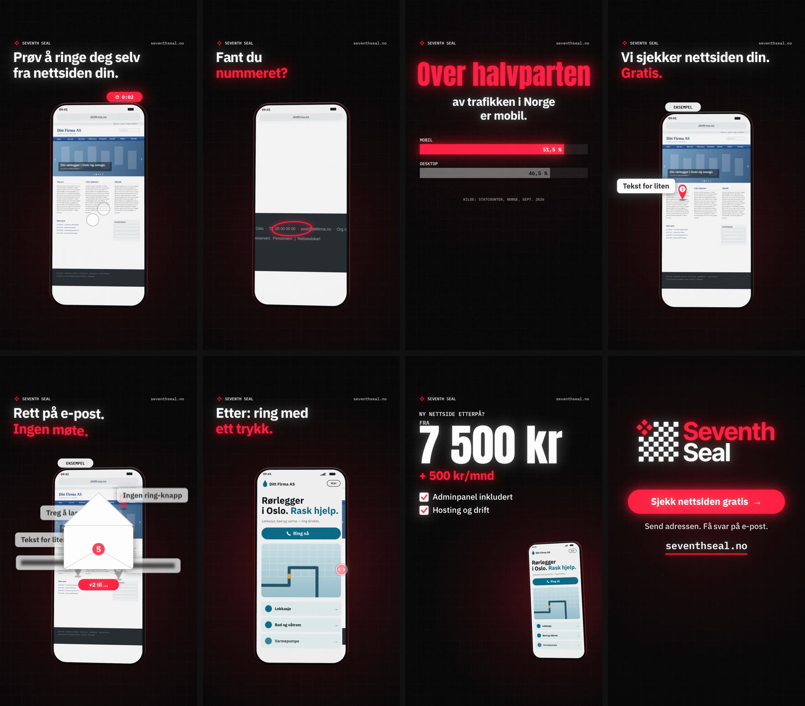

# SEVENTH SEAL — «Prøv å ringe deg selv» (vertical ad reel)

A 34-second, 1080×1920, 60 fps ad for Reels, TikTok and Shorts, aimed at **businesses with an outdated website**. The offer is the **free website check** (*gratis nettsidesjekk*: 3–5 concrete improvement points by e-mail). It's built in code on the same engine as [«Ditt trekk»](../dittrekk/).

**▶ [`prov-a-ringe-deg-selv.mp4`](prov-a-ringe-deg-selv.mp4)**  ·  poster: [`media/poster.jpg`](media/poster.jpg)



## Who it's for

Owners whose site was made years ago and "works". They don't see a problem, so the ad lets them *feel* one, with a challenge they can try right away on their own phone.

## The story, and why each beat is there

The research behind it, with sources, is in [`../research/short-form-ads.md`](../research/short-form-ads.md).

| Time | On screen | Why |
|---|---|---|
| 0:00 | *Prøv å ringe deg selv fra nettsiden din. På mobil.* A phone shows an old desktop site, too small to read. A thumb pinches, scrolls and misses, a cookie wall slides up, and a stopwatch runs | A challenge and a pattern interrupt. It calls out the audience and makes the viewer act it out in their head. The first frame reads on its own |
| 0:03.6 | *Fant du nummeret?* The camera zooms to the footer: the phone number was there all along, tiny | The payoff, a moment of recognition |
| 0:05 | *Over halvparten av trafikken i Norge er mobil.* Mobile 51,5 % vs desktop 46,5 % | A real, sourced figure (Statcounter, Norway, Sept. 2026) |
| 0:08 | *Vi sjekker nettsiden din. Gratis.* A scan line sweeps the site (labelled **EKSEMPEL**). Pins drop: *Tekst for liten*, *Ingen ring-knapp*, *Treg å laste*, then two more, blurred: **+2 til …** | Reciprocity, a free gift. The blurred two leave an open loop (Ovsiankina effect) |
| 0:12.6 | *3–5 konkrete forbedringspunkter.* → *Rett på e-post. Ingen møte.* The findings fold into an envelope | Specificity, and the effort it takes stated outright |
| 0:17 | The drop. A before/after wipe turns the old site into a modern one. *Etter: ring med ett trykk.* The thumb taps «Ring nå» and the call starts. *Nå når kundene deg.* | The peak, and it closes the hook's loop |
| 0:23 | *Ny nettside etterpå? Fra 7 500 kr + 500 kr/mnd*, then what's included | Transparent price, so the next step isn't a guess |
| 0:28 | Logo · **Sjekk nettsiden gratis →** · *Send adressen. Få svar på e-post.* · seventhseal.no | One CTA, worded like the button on seventhseal.no. Loops into the hook |

## Rules it follows

- **Pacing.** At most ~7 words per card at about 3 words a second, and every card holds at least 1.5 s.
- **Safe zones.** All copy sits inside y 280–1240.
- **Works muted.** Every message is on screen.
- **Honest.**
  - The old site and «Ditt Firma AS» are made up, and the site is labelled «Eksempel», so nobody thinks their own site was analysed.
  - The phone number shown is a placeholder (00 00 00 00).
  - The check's wording ("3–5 konkrete forbedringspunkter", "på e-post") follows seventhseal.no.
  - No reviews or customer counts are shown.

## Build it

From the repo root:

```bash
node scripts/render.mjs --src sjekk/src --out sjekk/prov-a-ringe-deg-selv.mp4
node scripts/render.mjs --src sjekk/src --stills 0,4.7,12,18.4              # PNG stills
```
